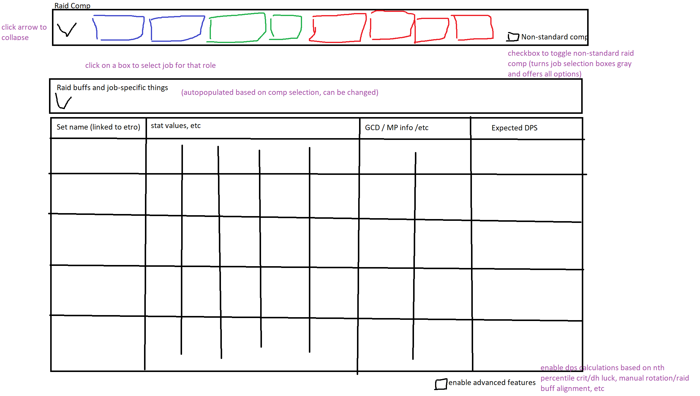

# ffxiv-dps-calc (work in progress)

let's stop using google sheets for gearsets like goddamn animals

## try out the calculator (should give same results as sch gear sheet)

edit `run_test()` with your stats/comp

run `python main.py` then `run_test()`

## mockup for future ui (please look forward to it)

## contributors

* aard appel (famfrit)
* Rhiow Silrah (Gilgamesh)
* HI MAYBE YOUR NAME HERE? potato 3059 on discord

## future plans: vague ramblings below

### immediate future

* clean up existing `main.py` file and split it into multiple files
* test cases
* naive pps calculation for sch (reimplement pps calc from the gearset spreadsheet but allow variable fight length)
    * pps calculations for healers should inherit: sch inherits from healer inherits from caster inherits from ppssim -- this should save a ton of work in future
    * pps for tanks should inherit: gnb inherits from tank inherits from melee inherits from ppssim
* percentile for probabalistic damage stats (crit and dh) for rng-grinders -- enter percentile to modify crit/dh rate accordingly
    * initial implementation will have naive estimate for number of damaging actions based on fight length

### soon(tm)

* web ui (and hosting) -- fill in your own stats, can compare multiple
* recommended gearset submission + display

### maybe one day (send help please)

* import set from etro (feasible or not?)
* raid buff planning -- click and drag to move buff windows around, see effect on gearset
* rotation planning -- visual rotation builder when default isn't enough. useful for fight phasing etc.
    * export/import rotations and raid buffs because i want to throw up at the thought of gcd mapping an entire fight and closing the tab and having to do it over
    * export rotation as html with images
        * stretch goal: export rotation as html with js or something to display tooltips when skills are hovered over
        * slightly less stretch goal: toggle for generating saltedxiv-compatible html to display tooltips
